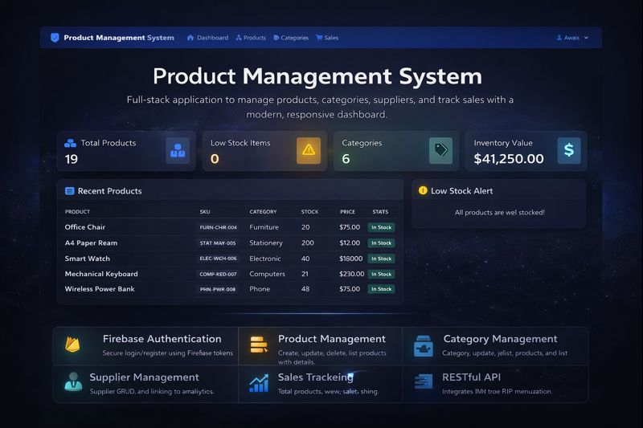
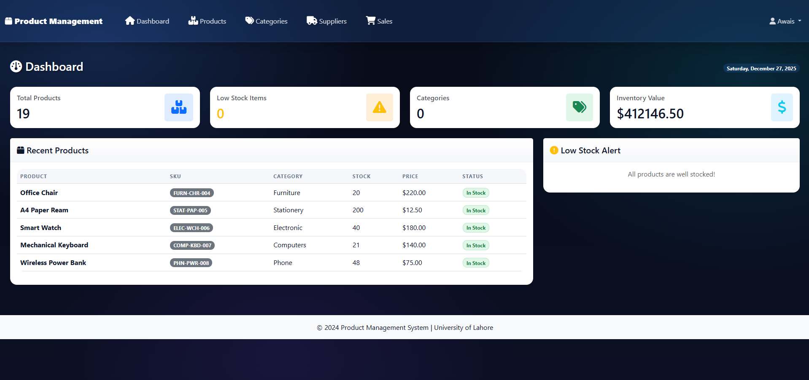
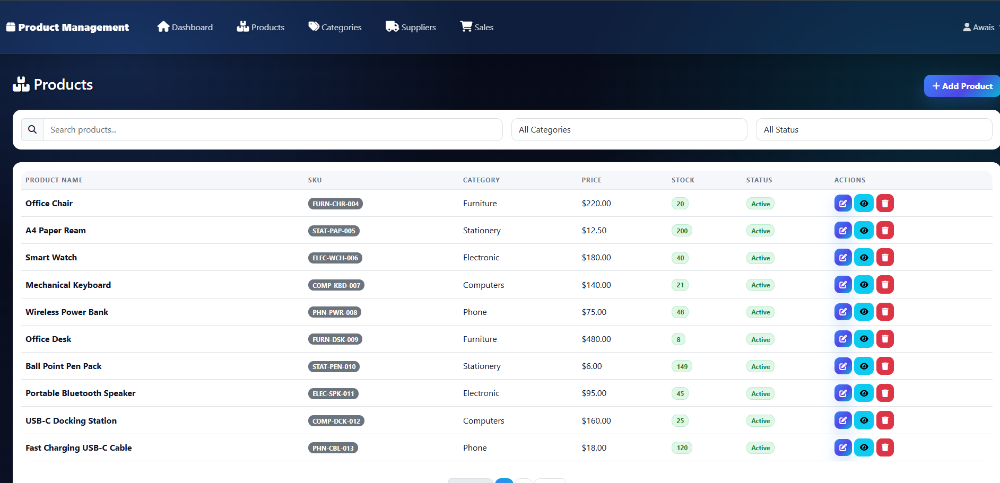
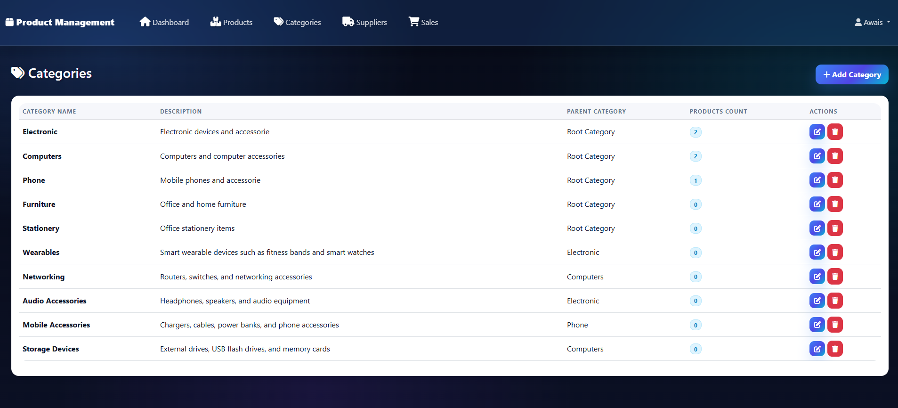
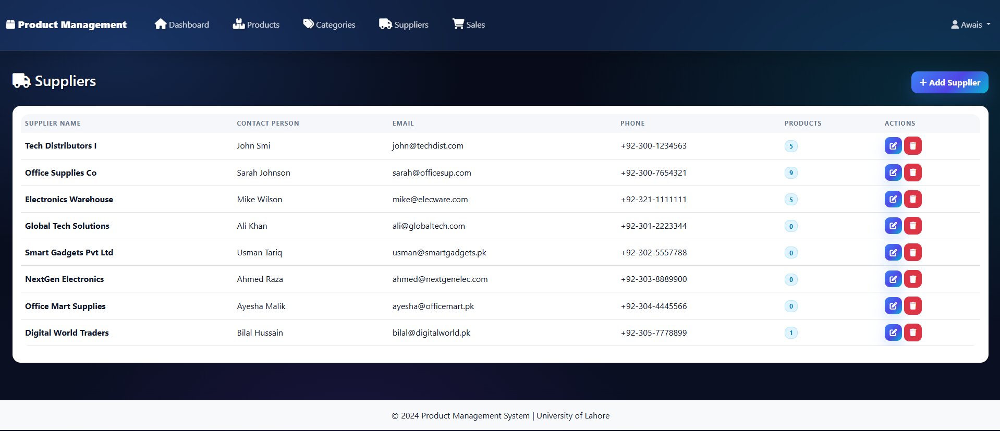
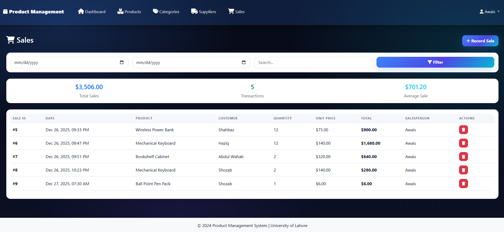

# Product Management System 

> A full-stack **Product Management System** built with **Flask (REST API)** and a **Bootstrap web dashboard**, featuring **Firebase Authentication**, CRUD for products/categories/suppliers, and sales tracking — designed with clean architecture patterns (Repository + Service layers).

---

## Description

This project provides a complete product management workflow:
- Secure login/register via **Firebase Authentication**
- Manage **Products**, **Categories**, **Suppliers**
- Track **Sales** and inventory-related stats
- Modern dashboard UI with analytics-style overview

It is structured using maintainable patterns:
- **Repository Layer** (data access)
- **Service Layer** (business logic)
- **Controllers** (API & web routes)
- **Middleware** (auth protection)

---

<p align="center">
  
</p>

---

## Features

| Feature | Details |
|---|---|
| Firebase Authentication | Secure login/register using Firebase tokens |
| Product Management | Create, update, delete, list products with details |
| Category Management | Category CRUD, product-category association |
| Supplier Management | Supplier CRUD and linking to products |
| Sales Tracking | Record sales, view sales history, sales totals |
| Dashboard Overview | Total products, stock alerts, inventory value, recent activity |
| Low Stock Alerts | Detect items below reorder level |
| Clean Architecture | Controllers + Services + Repositories separation |
| REST API | Structured JSON API endpoints for frontend usage |

---

## Dashboard Screenshots

<p align="center">
  
</p>

---

<p align="center">
  
</p>

---

<p align="center">
  
</p>

---

<p align="center">
  
</p>

---

<p align="center">
  
</p>


---

## Project Structure

```bash
FlaskProjectSCD/
└── FlaskProjectSCD/
    ├── app/
    │   ├── controllers/
    │   │   ├── auth_controller.py
    │   │   ├── category_controller.py
    │   │   ├── product_controller.py
    │   │   ├── sales_controller.py
    │   │   ├── supplier_controller.py
    │   │   └── web_controller.py
    │   ├── middleware/
    │   │   └── auth_middleware.py
    │   ├── models/
    │   │   ├── category.py
    │   │   ├── inventory.py
    │   │   ├── product.py
    │   │   ├── sales.py
    │   │   ├── supplier.py
    │   │   └── user.py
    │   ├── repositories/
    │   │   ├── base_repository.py
    │   │   ├── category_repository.py
    │   │   ├── product_repository.py
    │   │   ├── sales_repository.py
    │   │   ├── supplier_repository.py
    │   │   └── user_repository.py
    │   ├── services/
    │   │   ├── auth_service.py
    │   │   ├── category_service.py
    │   │   ├── product_service.py
    │   │   ├── sales_service.py
    │   │   └── supplier_service.py
    │   ├── utils/
    │   │   └── response_handler.py
    │   └── config.py
    ├── static/
    │   ├── css/
    │   │   └── style.css
    │   └── js/
    │       ├── auth.js
    │       ├── categories.js
    │       ├── firebase-config.js
    │       ├── main.js
    │       ├── products.js
    │       ├── sales.js
    │       └── suppliers.js
    └── templates/
        ├── auth/
        │   ├── login.html
        │   └── register.html
        ├── base.html
        ├── categories.html
        ├── dashboard.html
        ├── product_detail.html
        ├── products.html
        ├── sales.html
        └── suppliers.html
